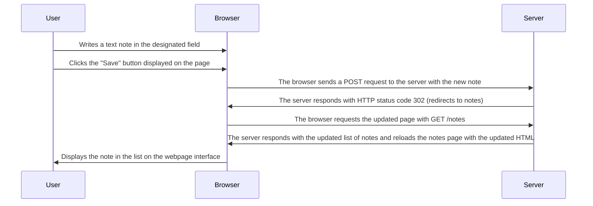

```mermaid
sequenceDiagram

    participant User
    participant Browser
    participant Server

    User->>Browser: Writes a text note in the designated field
    User->>Browser: Clicks the "Save" button displayed on the page
    Browser->>Server: The browser sends a POST request to the server with the new note
    Server->>Browser: The server responds with HTTP status code 302 (redirects to notes)
    Browser->>Server: The browser requests the updated page with GET /notes
    Server->>Browser: The server responds with the updated list of notes and reloads the notes page with the updated HTML
    Browser->>User: Displays the note in the list on the webpage interface
```