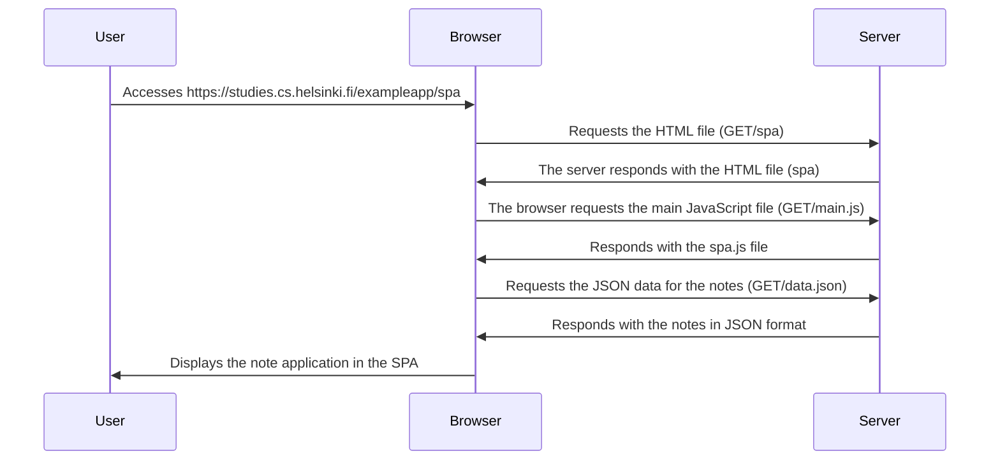

```mermaid
sequenceDiagram
    participant User
    participant Browser
    participant Server

    User->>Browser: Accesses https://studies.cs.helsinki.fi/exampleapp/spa
    Browser->>Server: Requests the HTML file (GET/spa)
    Server->>Browser: The server responds with the HTML file (spa)
    Browser->>Server: The browser requests the main JavaScript file (GET/main.js)
    Server->>Browser: Responds with the spa.js file
    Browser->>Server: Requests the JSON data for the notes (GET/data.json)
    Server->>Browser: Responds with the notes in JSON format
    Browser->>User: Displays the note application in the SPA
```