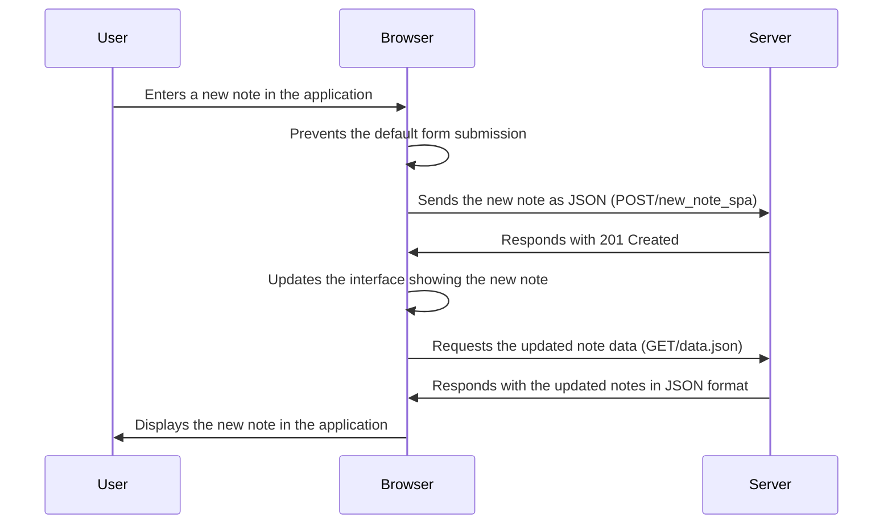

```mermaid
sequenceDiagram
    participant User
    participant Browser
    participant Server

    User->>Browser: Enters a new note in the application
    Browser->>Browser: Prevents the default form submission
    Browser->>Server: Sends the new note as JSON (POST/new_note_spa)
    Server->>Browser: Responds with 201 Created
    Browser->>Browser: Updates the interface showing the new note
    Browser->>Server: Requests the updated note data (GET/data.json)
    Server->>Browser: Responds with the updated notes in JSON format
    Browser->>User: Displays the new note in the application
```